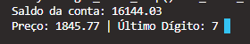
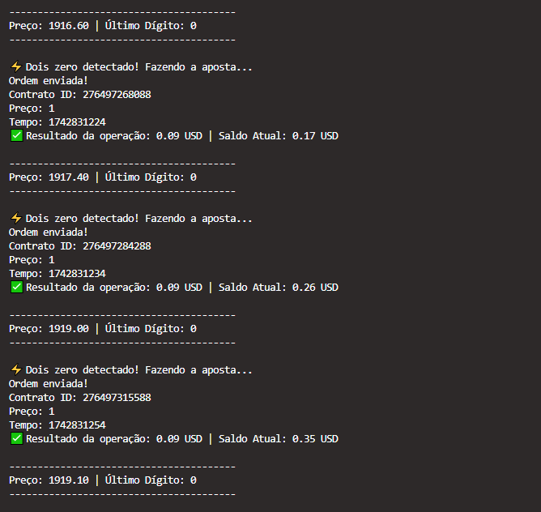
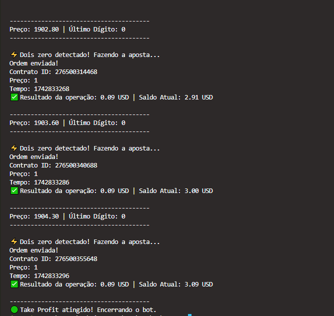

# Trading Bot com WebSocket - Deriv 🚀

Bem-vindo ao **Trading Bot Automatizado** para a plataforma **Deriv**, projetado para analisar e realizar apostas automaticamente no mercado **R_100**. Com este bot, você pode acompanhar o saldo da conta e executar operações com base em condições específicas do mercado.

## 📌 Funcionalidade

Este bot realiza as seguintes operações:

### 1. **Conexão com a API WebSocket da Deriv**:
- Autenticação com a chave da API fornecida pelo usuário.
- Solicitação de informações sobre o saldo da conta.
  
   <div align="center">
     
   </div>


### 2. **Monitoramento de Ticks**:
- Inscrição para receber ticks do mercado **R_100**.
- O bot monitora em tempo real o último dígito do preço, armazenando os dois últimos dígitos para análise posterior.

### 3. **Verificação de Condições de Stop Loss e Take Profit**:
- O bot verifica se o saldo atingiu os limites de **Stop Loss** (-10 USD) ou **Take Profit** (3 USD).
- Se atingido, o bot interrompe as operações.

### 4. **Estratégia de Apostas**:
- Quando os dois últimos dígitos do preço são "00", o bot aposta no **DIGITDIFF**, ou seja, aposta que o próximo preço não será 0.

### 5. **Resultado da Operação**:
- O bot aguarda o resultado da operação, atualiza o saldo e imprime o lucro ou a perda gerada pela aposta.

---

## ⚙️ Fluxo do Código

1. **Conexão e Autenticação**:
   - O bot se conecta ao WebSocket da Deriv e autentica utilizando a chave da API.
   - Após a autenticação, o saldo da conta é solicitado para garantir que a operação tenha fundos disponíveis.

2. **Acompanhamento de Ticks**:
   - O bot se inscreve para receber os ticks do mercado R_100 e começa a analisar os preços em tempo real.

3. **Verificação do Último Dígito**:
   - O bot verifica se o último dígito do preço é "00". Se sim, a aposta é realizada.

4. **Apostas e Monitoramento de Resultados**:
   - O bot realiza a aposta conforme a estratégia e monitora o resultado, ajustando o saldo em tempo real.

5. **Fechamento do Bot**:
   - O bot continua operando até atingir o limite de **Stop Loss** ou **Take Profit**, momento em que ele encerra as operações automaticamente.

---

## 💻 Exemplo de Uso

Aqui está um exemplo da execução do bot. As imagens abaixo mostram o fluxo da conexão e autenticação com a API da Deriv:

<div align="center">
   
   
</div>

---

## 🛠️ Requisitos

Para rodar este bot, você precisará dos seguintes requisitos:

- **Python 3.x**
- **WebSockets**
- **Acesso à API da Deriv** (gerar chave de API na plataforma da Deriv)

---

## ⚡ Instalação

Para rodar o bot, basta instalar as dependências utilizando o `pip`. Execute o comando abaixo para instalar o pacote `websockets`:

```bash
pip install websockets
